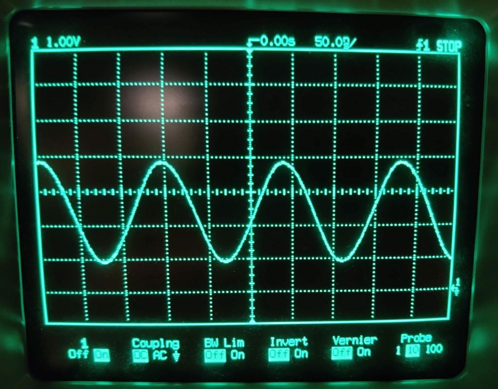
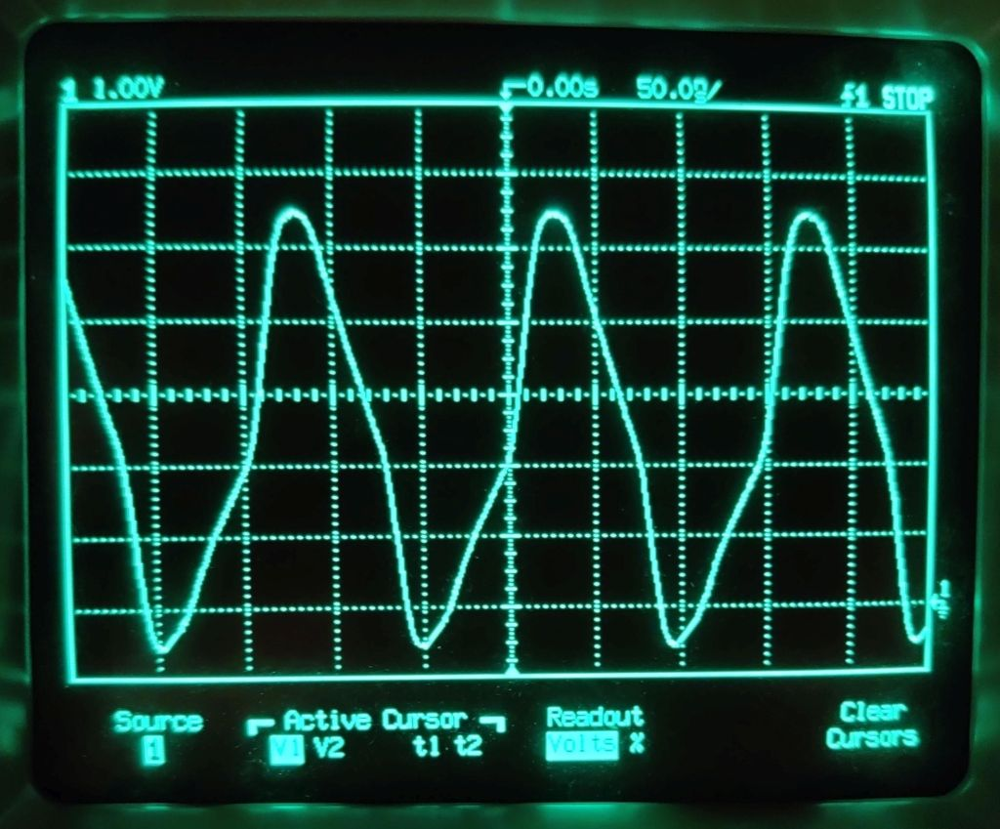
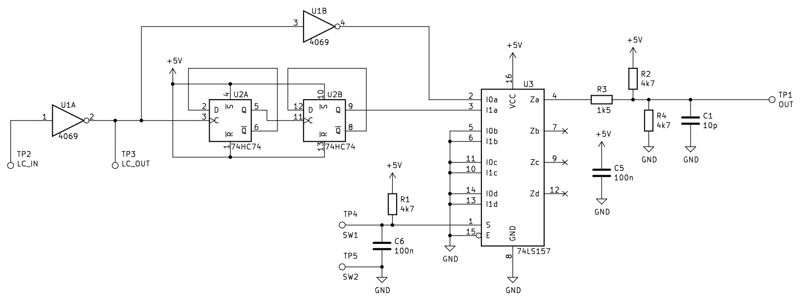

# sk-1-octave
## Octave switch for the Casio SK-1 keyboard

## Background
The SK-1 is a great keyboard, but it's range is limited due to the short 2.5 octave keyboard.

Looking at the schematic in the service manual (http://www.burnkit2600.com/manuals/CASIO_SK-1_SRVC.pdf), the clock for the microprocessor is generated by a simple LC oscillator, like what is presented here: http://www.learningaboutelectronics.com/Articles/Colpitts-oscillator-calculator.php.

The tuning of the instrument is controlled by a variable capacitor, which controls the frequency of the LC clock oscillator. The idea is to replace the inverter in the original oscillator with a CMOS inverter IC, add a clock divider to drop the frequency by four (down two octaves) and a multiplexer to select either the original or the divided frequency.

## Circuit design

## Installation

## Results
The circuits works well and unlocks some of the potential of this instrument. I really like the cruncy atmospheric sound of the lower octaves.

However there are some side effects (feature?) due to the nature of this hack. Since the clock speed for the whole system is slowed down, _everything_ slows down. Rythms (nice and crunchy, but slow), portamento, vibrato, envelopes etc. It doesn't bother me too much, but it should be noted that the integration is notot seamless.
