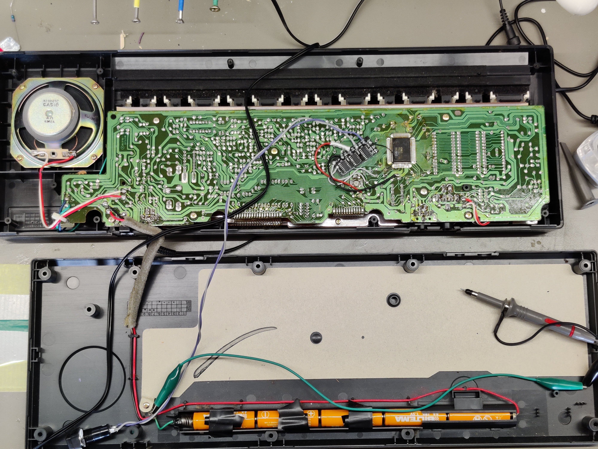
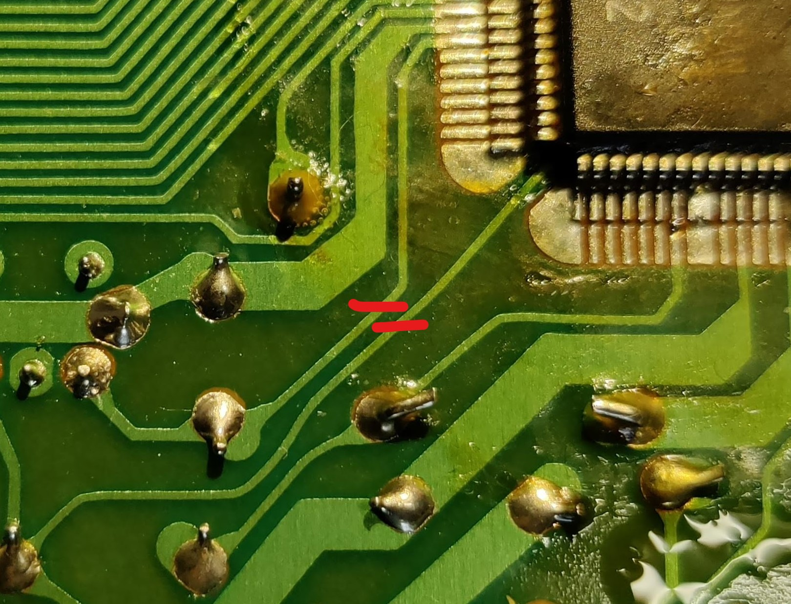
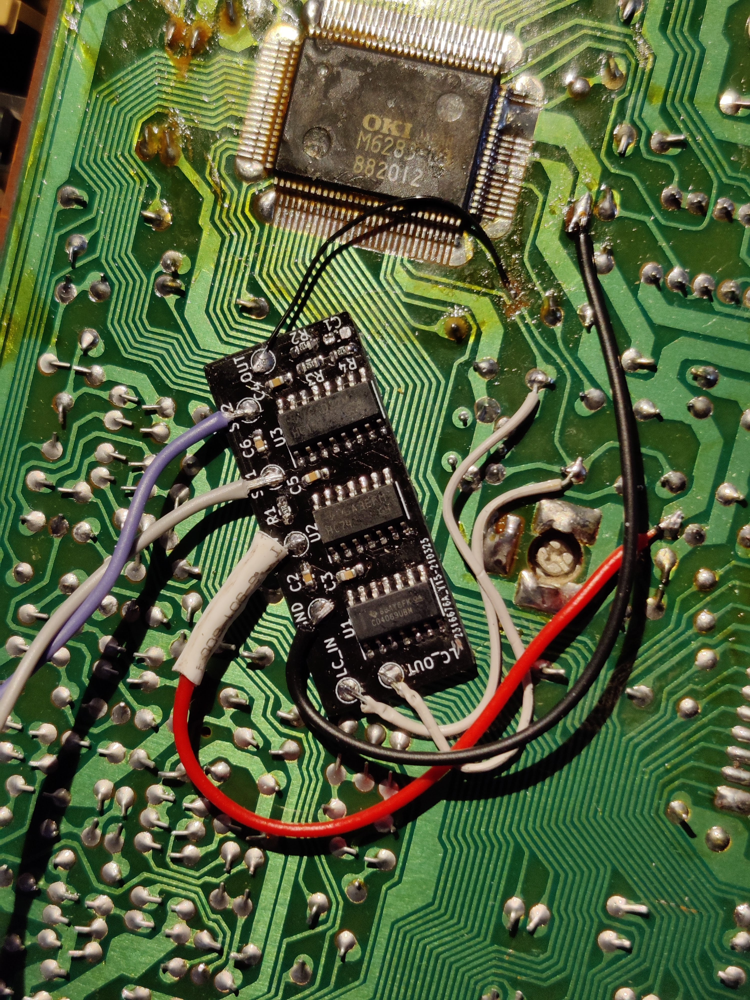
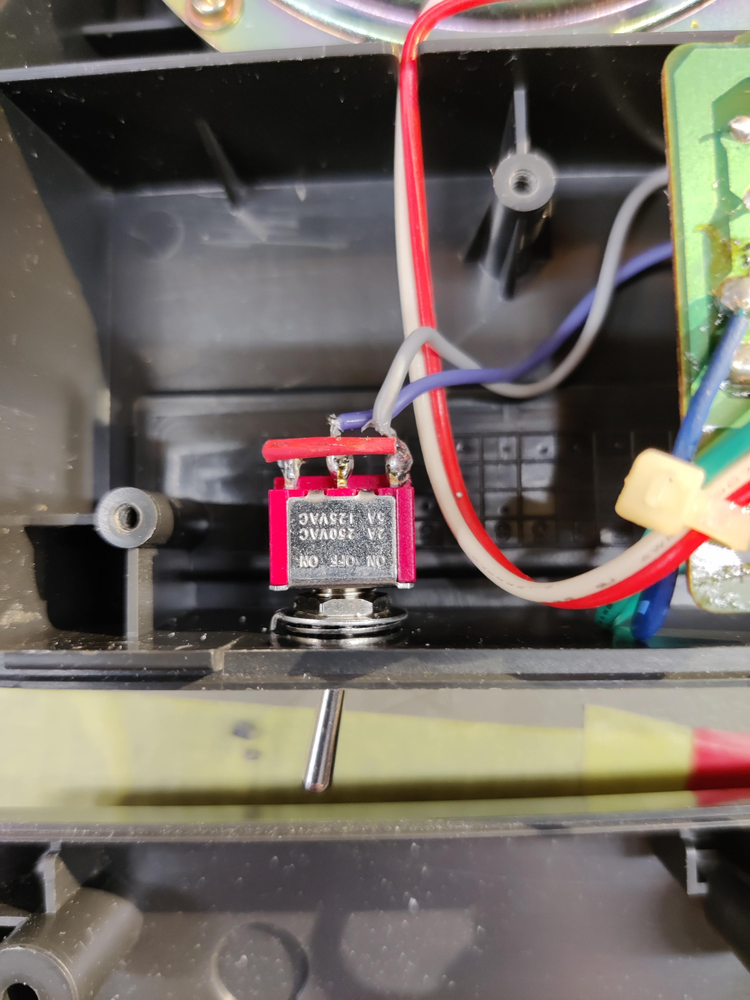

# sk-1-octave
## Octave switch for the Casio SK-1 keyboard

## Background
The SK-1 is a great keyboard, but it's range is limited due to the short 2.5 octave keyboard.

Looking at the schematic in the service manual (http://www.burnkit2600.com/manuals/CASIO_SK-1_SRVC.pdf), the clock for the microprocessor is generated by a simple LC oscillator, like what is presented here: http://www.learningaboutelectronics.com/Articles/Colpitts-oscillator-calculator.php.

The tuning of the instrument is controlled by a variable capacitor, which controls the frequency of the LC clock oscillator. The idea is to replace the inverter in the original oscillator with a CMOS inverter IC, add a clock divider to drop the frequency by four (down two octaves) and a multiplexer to select either the original or the divided frequency.

PCB area around the micro processor and LC oscillator circuit:

Original oscillator input signal:

Original oscillator output signal:

## Circuit design
The schematic and PCB was designed in KiCad.

The schematic below shows the circuit:

The oscillator core consists of the existing inductor and capacitors from the original circuit, but now connected to one part of U1, a 4069 hex CMOS inverter. The signal from the oscillator is divided by four by two stages from U2, a dual D flip-flop. Lastly, one of the original or divided down signals are selected by one channel of U3, a quad mux. The select input of the mux is connected to a switch that selects either the original frequency when the switch is closed, or the divided down frequency when the switch is open.

The R2, R3, R4 and C1 network scales the output to roughly the same voltage range as the original clock signal. This is probably not necessary but the circuit was included just to be safe. In the end, C1 was excluded.

The PCB is shown in the picture below:

All connections are made to test points around the edges for easy soldering.

## Installation
1. Open upp the case and place both halves upside down, exposing the main PCB.
2. Mount the octave switch PCB with double sided tape, hot glue or whatever you have at hand in the position shown in the picture 
3. Cut the traces going to the processor where indicated by the red lines in the picture, and scrape off the solder resist on the one going in under the corner of the IC: 
4. Solder wires to the octave switch PCB from the solder joints on the SK-1 PCB as shown in the picture. Solder in the OUT signal with as thin a wire as possible to minimize stress on the cut wire. Take care to leave the area close to the tuning inductor free from wires. 
5. Mount a toggle swithch to some convenient place in the case, probaly the empty space next to the speaker is most convenient. Connect the switch with long twisted wires to the SW1 and SW2 pads. 
6. Put your SK-1 back together and enjoy your extended note range!

It should be noted that the SK-1 uses a weird form of negative logic, so what is connected to GND the octave switch PCB is actually the negative supply rail, and what is connected to +5V is ground. What matters in the end is that both PCBs sees signals that are in the correct voltage ranges for their respective supplies.

## Results
Audio demos at [Soundcloud](https://soundcloud.com/exterm/sk-1-octave)

The circuit works well and unlocks some of the potential of this instrument. I really like the cruncy atmospheric sound of the lower octaves.

However there are some side effects (features?) due to the nature of this hack. Since the clock speed for the whole system is slowed down, _everything_ slows down. Rythms (nice and crunchy, but slow), portamento, vibrato, envelopes etc. It doesn't bother me too much, but it should be noted that the integration is not seamless.

## Disclaimer
1. Yes I know the soldering looks awful, I should probably redo it, but... meh.
2. The SK-1 PCB is covered in sticky flux. I did clean it up around the area where I attached the octave switch PCB, but yeah, I know it looks nasty.
